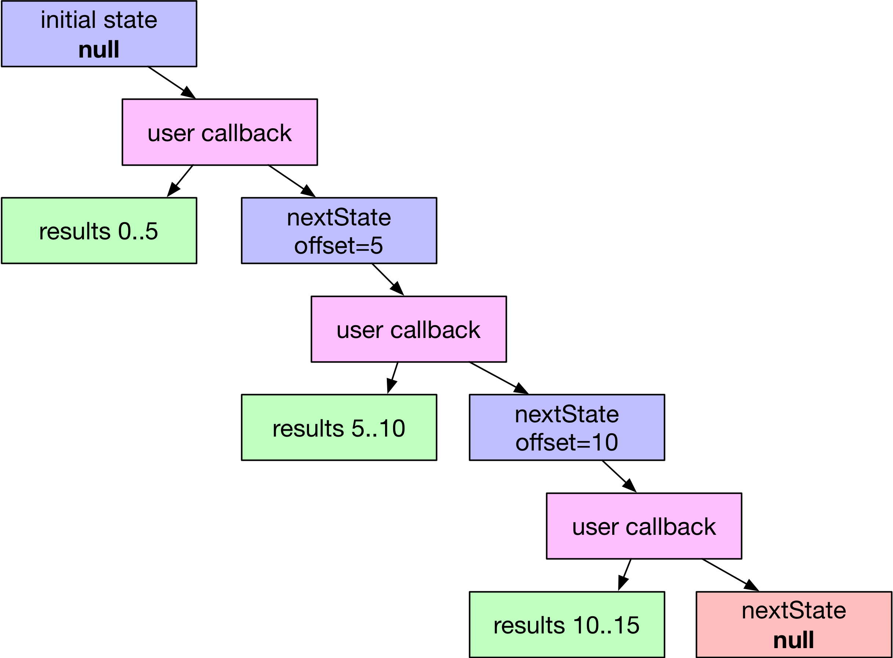

A minimal server for [linked data fragments](http://linkeddatafragments.org) designed to create linked data views over things that aren't linked data.

# Motivation

Existing LDF servers are typically used to expose a datasource with less restrictive querying capabilities (e.g. a SPARQL endpoint) with more restrictive querying capabilities (triple pattern fragments).

In contrast, ldf-facade is designed to expose a datasource with more restrictive querying capabilities - such as a HTTP API - as triple pattern fragments, which are often less restrictive than the API.

# Usage

There are two user callbacks used by ldf-facade which you need to implement:

* enumSubjects: enumerates all possible subjects in the dataset
* pattern: evaluates a triple pattern and returns some triples

Crucially, **everything is paginated**.  To accommodate this, the user callbacks are deterministic mappers from `state -> { results, nextState|null }`.  If called multiple times with the same state, the callback should return the same results each time.  The actual value of the state is entirely up to you: it could be an offset, an identifier, or anything else required to keep track of upstream position.

	

This allows the ldf-server to create prev and next links for each page, so that ldf clients can navigate a result set.  The nextState returned by a user callback becomes the state parameter passed into the same callback to retrieve the next page. 

## Creating a server

	var LDFServer, { BOUND, UNBOUND } = require('ldf-facade')

	var server = new LDFServer({ /* opts */ }) 

## Implementing enumSubjects

    server.enumSubjects(async function(state) {
        
        if(!state) {
        	// create initial state
        }
        
        // get some subjects from somewhere        
        // get total number of subjects
        
        return { values: [ subjects... ], total, nextState }
        
        // return nextState: null when there are no more subjects to enumerate 
    })

## Implementing pattern

You can register as many user callbacks for `pattern` as required.  Each pattern callback is associated with a pattern.  For example, a user callback registered for `{ s: BOUND, p: UNBOUND, o: UNBOUND }` would match triple patterns where the subject is specified but the predicate and object are not (e.g. tell me everything you know about this subject).

Where a pattern is requested of the server and no user callback is registered to match it, ldf-facade will attempt to generalise (for unbound -> bound) or specialize by filtering (for bound -> unbound).  In theory, this means that registering any one pattern allows any other pattern to be answered, but as generalisation and specialisation is likely to be very expensive, any patterns that can be answered directly should be registered.

    server.pattern({ 
    	s: BOUND, p: UNBOUND, o: UNBOUND
    }, async function(state, pattern) {
    
    	// pattern.s contains the subject as it is bound
    	// pattern.p and pattern.o will be undefined
    	
    	// generate triples that match { pattern.s, ?, ? }
    	
    	return { triples, total, nextState }

        // return nextState: null when there are no more triples to return 
    })

## Starting the server

    server.listen(port)

